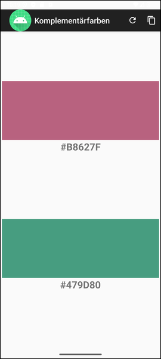
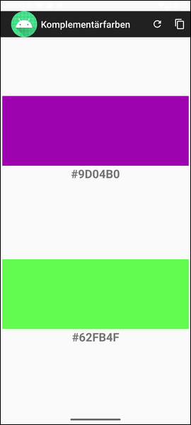

# Android-App "Komplementärfarben" #

 

Dieses Repo enthält ein Android-Studio-Projekt für eine native Android-App.
Die App zeigt immer zwei Farben an: eine zufällig erzeugte Farbe und die zugehörige 
[Komplementärfarbe](https://de.wikipedia.org/wiki/Komplement%C3%A4rfarbe).
Hiermit soll die Verwendung der Klasse 
[ViewModel](https://developer.android.com/reference/kotlin/androidx/lifecycle/ViewModel)
in einer Android-App demonstriert werden.

 

----

## Screenshots ##

 

 &nbsp; 

 

----

## License ##

 

See the [LICENSE file](LICENSE.md) for license rights and limitations (BSD 3-Clause License).

 
